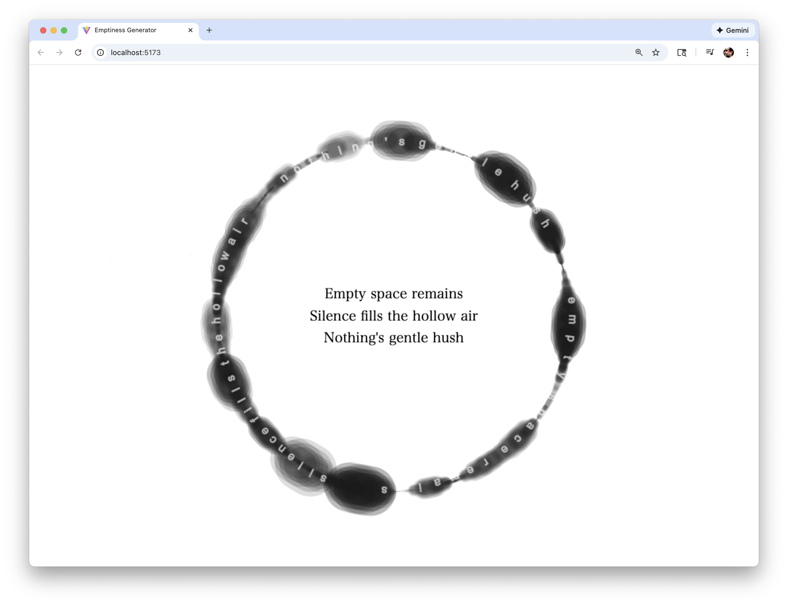

# Emptiness Generator (Ollama)

A zen-inspired haiku generator that creates minimalist, animated haikus about emptiness (sunyata) using generative AI. The application features a beautiful, meditative interface with circular enso animations and particle-based text rendering.



## Overview

Emptiness Generator is a web application that generates haikus about emptiness and mindfulness using a **local Ollama instance**. The haikus are displayed with elegant animations, featuring:

- **Dynamic Enso Animation**: A circular ink-like animation that draws continuously
- **Particle-Based Text**: Each letter is rendered as a particle that follows the circular path
- **English Haikus**: Generates haikus in English
- **Streaming Text**: Text appears letter-by-letter as it's generated
- **Fade Effects**: Smooth fade-in and fade-out transitions
- **Zen Aesthetic**: Minimalist white background with elegant typography

> ⚠️ **Important**: This application requires **Ollama to be installed and running locally** on your machine. It connects to `http://localhost:11434` to generate haikus. See the setup instructions below.

## Features

### Visual Features
- **Enso Animation**: Multiple simultaneous circular animations that draw dynamically, creating an ink-like effect
- **Particle System**: Each letter is a particle that floats and follows the circular animation path
- **Floating Effect**: Letters gently float vertically and radially
- **Transparency**: Letters rendered with 60% opacity for a subtle, ethereal appearance
- **Dual Display**: Haiku displayed both along the circular path and in the center

### Functional Features
- **AI-Powered Generation**: Uses Ollama with the `llama3.2` model for haiku generation
- **Streaming Response**: Text appears in real-time as it's generated
- **Auto-Regeneration**: New haikus generate every 20 seconds
- **Manual Control**: Press spacebar to start generation and animation
- **Error Handling**: Displays helpful messages when Ollama is not running
- **Responsive Design**: Adapts to window resizing

## Technology Stack

This project uses modern web technologies to create a smooth, animated experience:

### Core Technologies

- **TypeScript** (v5.9.3) - Type-safe JavaScript for better code quality and developer experience
- **Vite** (v7.2.4) - Fast build tool and development server with hot module replacement
- **HTML5 Canvas API** - Native browser API for rendering animations and graphics
- **Ollama** - Local AI runtime for running large language models (LLMs) on your machine
- **llama3.2** - Meta's Llama 3.2 language model (runs locally via Ollama)

### Key Libraries

- **Google Fonts** - Web fonts (Cormorant Garamond, Playfair Display) loaded via CDN

### Why These Technologies?

- **TypeScript**: Provides type safety and better IDE support, reducing bugs
- **Vite**: Extremely fast development server and optimized production builds
- **Canvas API**: Direct pixel-level control for smooth animations and custom rendering - no external animation libraries needed
- **Ollama**: Enables local AI processing without cloud dependencies or API costs

### System Requirements

- **Node.js** v16 or higher - Required to run the development server and build tools
- **npm** or **yarn** - Package manager (comes with Node.js)
- **Modern Browser** - Chrome, Firefox, Safari, or Edge with Canvas API support
- **Ollama** - Must be installed separately (see installation instructions below)

## Requirements

### Prerequisites
- **Node.js** (v16 or higher) - [Download here](https://nodejs.org/)
- **npm** (comes with Node.js) or **yarn**
- **Ollama** installed and running locally - [Download here](https://ollama.ai)
- **llama3.2 model** installed in Ollama

## Quick Start

### Step 1: Install Ollama

1. **Download and install Ollama**:
   - Visit [https://ollama.ai](https://ollama.ai)
   - Download and install Ollama for your operating system (Windows, macOS, or Linux)
   - Follow the installation instructions for your platform

2. **Install the llama3.2 model**:
   ```bash
   ollama pull llama3.2
   ```
   This may take a few minutes depending on your internet connection.

3. **Verify Ollama is installed**:
   ```bash
   ollama list
   ```
   You should see `llama3.2` in the list.

### Step 2: Clone and Setup the Project

1. **Clone this repository**:
   ```bash
   git clone <your-repo-url>
   cd "videt test"
   ```

2. **Install project dependencies**:
   ```bash
   npm install
   ```

### Step 3: Run the Application

1. **Start Ollama** (in a separate terminal):
   ```bash
   ollama serve
   ```
   Keep this terminal open. Ollama should be running on `http://localhost:11434`

2. **Start the development server** (in another terminal):
   ```bash
   npm run dev
   ```

3. **Open your browser**:
   - Navigate to the URL shown in the terminal (typically `http://localhost:5173`)
   - Press **SPACEBAR** to start generating haikus

## Usage

### Important: Ollama Must Be Running

⚠️ **Before starting the app, make sure Ollama is running:**
- Open a terminal and run: `ollama serve`
- Keep that terminal window open
- The app connects to `http://localhost:11434` - this is where Ollama runs by default

### Using the Interface

1. **Initial Screen**: A home page with instructions appears on load
2. **Start Generation**: Press **SPACEBAR** to begin
   - The enso animation starts
   - A haiku begins generating in English
   - Text appears letter-by-letter along the circular path
3. **Auto-Regeneration**: New haikus generate every 20 seconds
4. **Fade Effects**: Each haiku fades in when generated and fades out before the next one

### Error Handling

If Ollama is not running, the application displays an error message:
- **"Ollama is not running. Please start Ollama and try again."**
- Instructions to ensure Ollama is running on `localhost:11434`

**To fix this error:**
1. Open a terminal
2. Run: `ollama serve`
3. Wait for Ollama to start (you'll see it listening on port 11434)
4. Refresh the browser page

## Technical Details

### Architecture

The application follows a client-side architecture:

- **Frontend Only**: Pure client-side application (no backend server needed)
- **Local AI**: Connects directly to Ollama running on `localhost:11434`
- **Canvas Rendering**: All visuals rendered using HTML5 Canvas API
- **Streaming API**: Uses Ollama's streaming API for real-time text generation
- **Animation Loop**: Uses `requestAnimationFrame` for smooth 60fps animations

### Technology Breakdown

#### Build & Development
- **Vite**: Modern build tool that provides:
  - Instant server start
  - Lightning-fast Hot Module Replacement (HMR)
  - Optimized production builds
  - Native ES modules support

#### Language & Type Safety
- **TypeScript**: Adds static typing to JavaScript:
  - Compile-time error checking
  - Better IDE autocomplete
  - Self-documenting code through types
  - Strict mode enabled for maximum safety

#### Rendering & Animation
- **HTML5 Canvas**: Low-level graphics API for:
  - Custom particle systems
  - Smooth animations at 60fps
  - Direct pixel manipulation
  - Custom text rendering along paths

#### AI Integration
- **Ollama API**: RESTful API for local LLM inference:
  - Streaming responses for real-time text
  - No external API keys required
  - Complete privacy (all processing local)
  - Supports multiple models

### Project Structure

```
videt test/
├── index.html          # Main HTML file
├── package.json        # Dependencies and scripts
├── tsconfig.json       # TypeScript configuration
├── vite.config.ts      # Vite configuration
├── src/
│   ├── main.ts        # Main application logic
│   └── style.css      # Styling
└── public/
    └── vite.svg       # Favicon
```

### Key Components

#### ZenHaikuGenerator Class

The main class that handles all functionality:

- **Canvas Management**: Sets up and manages the HTML5 canvas
- **Animation Loop**: Continuous rendering using `requestAnimationFrame`
- **Haiku Generation**: Integrates with Ollama API for haiku generation
- **Particle System**: Manages letter particles and their animations
- **Enso Animation**: Draws the circular ink-like animations
- **Event Handling**: Manages user interactions (spacebar, window resize)

#### LetterParticle Interface

Represents each letter as a particle:
- Position (x, y) and target position
- Angle on the circular path
- Opacity and visibility
- Velocity for smooth movement
- Base radius for floating effects

#### HaikuLine Interface

Represents each line of the haiku:
- Text content
- Array of letter particles
- Base angle on circle
- Streaming state

### Configuration

Key configuration options in `src/main.ts`:

```typescript
// Ollama Configuration
private ollamaBaseUrl: string = 'http://localhost:11434'
private model: string = 'llama3.2'

// Generation Settings
private generationInterval: number = 20000 // 20 seconds
// Haikus are generated in English only

// Animation Settings
private ensoSpeedMultiplier: number = 1.5
private fadeInSpeed: number = 0.02
private fadeOutSpeed: number = 0.015
private numEnsoCircles: number = 3 // Number of simultaneous circles
```

### Fonts

The application uses Google Fonts:
- **Cormorant Garamond**: For decorative elements
- **Playfair Display**: For decorative elements
- **Arial/Helvetica**: For English text (simpler font)

### API Integration

#### Ollama API Endpoint

The application makes POST requests to:
```
POST http://localhost:11434/api/chat
```

Request body:
```json
{
  "model": "llama3.2",
  "messages": [
    {
      "role": "user",
      "content": "Write a simple haiku about emptiness (sunyata) in English..."
    }
  ],
  "stream": true
}
```

#### Prompt Structure

The prompt instructs the model to:
- Write a haiku about emptiness (sunyata) in English
- Follow haiku structure (5-7-5 syllables)
- Keep it simple and minimal
- Focus on emptiness, void, nothingness, space, silence
- Return only the three lines, no extra text

## Development

### Available Scripts

- `npm run dev`: Start development server
- `npm run build`: Build for production
- `npm run preview`: Preview production build

### Building for Production

```bash
npm run build
```

The built files will be in the `dist/` directory.

### TypeScript Configuration

The project uses TypeScript with strict type checking. Configuration is in `tsconfig.json`.

## Troubleshooting

### Common Issues

1. **"Ollama is not running" error**
   - **Problem**: The app can't connect to Ollama
   - **Solution**: 
     - Open a terminal and run: `ollama serve`
     - Keep that terminal window open
     - Verify Ollama is running by visiting `http://localhost:11434` in your browser (you should see Ollama's API info)
     - Refresh the app page

2. **Model not found**
   - **Problem**: The `llama3.2` model isn't installed
   - **Solution**: 
     - Run: `ollama pull llama3.2`
     - Wait for the download to complete (this may take several minutes)
     - Verify with: `ollama list` (you should see `llama3.2` in the list)

3. **Text not visible**
   - **Solution**: 
     - Ensure the canvas is properly initialized
     - Check browser console for errors (F12)
     - Try resizing the window to trigger a redraw
     - Make sure you've pressed SPACEBAR to start generation

4. **Port already in use**
   - **Problem**: Port 5173 (Vite) or 11434 (Ollama) is already in use
   - **Solution**: 
     - For Vite: Change the port in `vite.config.ts` or stop the process using port 5173
     - For Ollama: Stop any other Ollama instances or change the port in Ollama config

5. **Connection refused errors**
   - **Problem**: Browser can't reach `localhost:11434`
   - **Solution**: 
     - Make sure Ollama is actually running (`ollama serve`)
     - Check if a firewall is blocking localhost connections
     - Try accessing `http://localhost:11434/api/tags` in your browser to test the connection

### Debug Mode

The application includes console logging for debugging:
- Haiku generation progress
- Particle visibility states
- Animation state changes
- API responses

Open browser developer tools (F12) to see debug information.

## Customization

### Changing Generation Interval

Edit `generationInterval` in `src/main.ts`:
```typescript
private generationInterval: number = 20000 // Change to desired milliseconds
```

### Adjusting Animation Speed

Modify `ensoSpeedMultiplier`:
```typescript
private ensoSpeedMultiplier: number = 1.5 // Increase for faster, decrease for slower
```

### Changing Colors

Edit the color values in drawing methods:
- Text color: `rgb(255, 255, 255)` (white)
- Enso color: `rgb(0, 0, 0)` (black)
- Background: `#ffffff` (white) in `style.css`

### Changing Language

Currently, the application generates haikus only in English. To add support for other languages:

1. Modify the `streamOllamaHaiku()` method to include language selection logic
2. Add language instructions to the prompt
3. Update font handling if needed for the new language script

## Philosophy

This application embodies the concept of **sunyata** (emptiness) in Buddhist philosophy:
- **Simplicity**: Minimal interface and design
- **Impermanence**: Text appears and fades, representing the transient nature of existence
- **Emptiness**: The haikus focus on void, space, and absence
- **Mindfulness**: The slow, meditative pace encourages contemplation

## License

This project is private and for personal use.

## Acknowledgments

- **Ollama**: For providing local AI capabilities
- **Google Fonts**: For beautiful typography
- **Vite**: For excellent development experience

---

**Note**: This application requires Ollama to be running locally. It does not connect to external APIs or services, ensuring privacy and allowing offline use once Ollama is set up.
